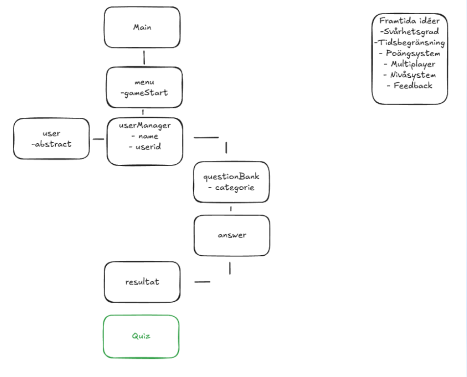

# 🎯 **Quiz – Projektredovisning**
**Grupp 7**  
👤 Robin Palm  
👤 Stefan Öberg  
👤 Alex Reichstein  

---

## 📊 **Resultat**
Bilder på terminaloutput och highscore-listor finns i presentationen.

---

# 🧠 **Projektvision**

## 🔭 Vad visualiserade vi oss?
### 🎯 Mål (realistiskt)
- En applikation som ställde frågor och tog emot svar  
- En scoreboard som visade tidigare resultat

## 🚀 Vad blev det?
- Vi gick i mål med det vi visualiserade  
- Därefter vidareutvecklade vi fler idéer längs vägen  

## ⏳ Hur långt är det kvar?
- ⏱️ TimeLimit  
- 🖥️ GUI  

---

# 🏃‍♂️ **Sprintar**

## 🟦 **Sprint 1**
**Scrum Master:** Robin Palm  
**Sekreterare:** Alex Reichstein  
**Utvecklare:** Stefan Öberg + Team  

### ✅ Mål  
- Research  
- Få fram grunden  
- Klargöra Definition of Done  

### 📦 Product Backlog  
- Menu  
- User  
- Usermanager  
- Questionbank  
- Result  

### ⚠️ Risker  
- Att vi siktar för högt  
- Att våra delar inte passar ihop  

### 👥 Vem gör vad?
| Namn   | Uppgifter |
|--------|-----------|
| Robin  | Menu, Result |
| Alex   | User, Usermanager |
| Stefan | QuestionBank |

---

## 🟩 **Sprint 2**
**Scrum Master:** Alex Reichstein  
**Sekreterare:** Robin Palm  
**Utvecklare:** Stefan Öberg + Team  

### 🎯 Mål  
Utveckla *questions*  

### 📦 Product Backlog  
- Poängsystem  
- Randomnumbergenerator  
- Nivåsystem  

### ⚠️ Risker
- Att vi siktar för högt
- Att våra delar inte passar ihop

### 👥 Vem gör vad?
| Namn | Uppgifter |
|------|-----------|
| Robin | Poängsystem |
| Alex | Nivåsystem |
| Stefan | Randomnumbergenerator |

---

## 🟧 **Sprint 3**
**Scrum Master:** Stefan Öberg  
**Sekreterare:** Alex Reichstein  
**Utvecklare:** Robin Palm + Team  

### 🎯 Mål  
Utveckla *questions*

### 📦 Product Backlog  
- Save & Load  
- Leaderboard  
- Optimera questions  

### ⚠️ Risker
- Att mergen går fel
- Att våra delar inte passar ihop

### 👥 Vem gör vad?
| Namn | Uppgifter |
|------|-----------|
| Robin | Save & Load |
| Alex | Leaderboard |
| Stefan | Questions |

---

## 🟥 **Sprint 4**
**Scrum Master:** Robin Palm  
**Sekreterare:** Stefan Öberg  
**Utvecklare:** Alex Reichstein + Team  

### 🎯 Mål  
Arbeta vidare med GUI och TimeLimit  

### 📦 Product Backlog  
- GUI  
- TimeLimit  

### ⚠️ Risker
- Att det tar för lång tid & svårt

### 👥 Vem gör vad?
Alla tre: GUI + TimeLimit 🎨⏱️

---

---
# 🗃️ **GitHub Projects**
Vi började lägga User Stories i GitHub Projects och lärde oss navigera verktyget.  
➡️ Vi upplevde att det var *väldigt användbart* för struktur, kategorisering och planering.

---

# 👨‍💻 **Vem gjorde vad?**

## 🧑‍💻 Alex Reichstein
- Menu  
- Randomnumbergenerator  
- Result  
- TimeLimit  
- Usermanager  

## 🧑‍💻 Stefan Öberg
- QuestionBank  
- PointSystem  
- FeedBack  
- Levels  
- Answer  

## 🧑‍💻 Robin Palm
- Player  
- Save & Load  
- StoppKnapp  
- Category  
- Leaderboard  

---

# 🤝 **Hur vi fördelade uppgifter**
Vi körde mycket *collaboration* och valde uppgifter baserat på vad som behövde göras 
– inga konflikter eller svårigheter kring rollenfördelning.

---

# 📌 **MoSCoW-metoden**
Vi valde att försöka oss på en av metodikerna vi fått lära,
och gick på MoSCow metoden och utgick mycket från den under projektets gång:

✔️ Must have  
✔️ Should have  
✔️ Could have  

---

# 🕒 **Daily Scrums** (Mall)

- Scrum Master  
- Sekreterare  
- Utvecklare  
- Närvarande  

**Varje Daily Scrum:**

1. Vad är sprintmålet?  
2. Vad gjorde jag igår som hjälpte teamet?  
3. Vad ska jag göra idag?  
4. Finns blockers?  

---

# 🔍 **Sprint Review (mall)**

**Datum:** []  
**Tid:** [] - []  
**Sprint nummer:** []  
**Sprint period:** [] till []  
**Närvarande:** []  
**Frånvarande:** []  
**Mötesroll - Anteckningar:** []

### Del 1: Sprint Översikt
**Vårt mål var:**  
**Uppnådde vi målet?**

### Del 2: Vad blev KLART? (Definition of Done uppfylld)
**Vad levererade vi:**  
**Acceptanskriterier – uppfyllda:**  
**Bevis på färdigställande:**  
**Lärdomar/Utmaningar:**

### Del 3: Vad blev INTE klart?
**Vad blev gjort:**  
**Varför blev det inte klart:**  
**Plan framåt:**

---

# 🔁 **Sprint Retrospective (mall)**

**Datum:** []  
**Tid:** [] - []  
**Sprint nummer:** []  
**Sprint period:** [] till []  
**Närvarande:** []  
**Frånvarande:** []  
**Mötesroll - Anteckningar:** []

- **Liked – Vad gillade jag?**
- **Learned – Vad lärde jag mig?**
- **Lacked – Vad saknades?**
- **Longed For – Vad längtade jag efter?**

## Område 1: Kommunikation & Samarbete
- **Vad fungerade bra:**
- **Vad fungerade mindre bra:**
- **Konkret förbättring till nästa sprint:**

## Område 2: Tekniska Processer
- **Vad fungerade bra:**
- **Vad fungerade mindre bra:**
- **Konkret förbättring till nästa sprint:**

## Område 3: Estimering & Planering
- **Var våra estimat realistiska?**
- **Analys:**
- **Förbättring:**

---

# 💬 **Reflektion**

## 🧩 Vad har vi lärt oss?
- 🤝 Samarbete är nyckeln till framgång  
- 📐 Struktur & tydlighet i vad vi vill uppnå  

## 🎁 Vad tar vi med oss?
- Ett roligt och användbart arbetssätt som pushar teamet framåt  

---

# 📣 **Kommunikation**
Vår största utmaning i början var kommunikationen.  

### Hinder:
- Bara tre i gruppen  
- Tillgänglighet  
- Tid för Daily-Scrum  

---

# ✔️ **Vår lösning**
En enkel lösning:  
👉 *Delad Scrum* – vilket ibland blev två Daily Scrums samma dag.  

Rätt? Fel?  
➡️ Det fungerade för oss! 💪😄
